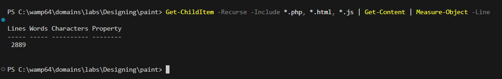

# 🖌️ Paint 

## Опис
**Paint ** — це функціональний графічний редактор, що дозволяє малювати різноманітними інструментами, додавати фігури, текст, застосовувати заливку та зберігати зображення у форматі PNG.

---

## 📋 Зміст
1. [Головне меню]
2. [Функціональність малювання]
3. [Робота з файлами]
4. [Використані принципи та патерни]

---

### 🎨 Головне меню
- **Почати малювання** – перехід до основного полотна.

### 🛠️ Інструменти малювання (панель інструментів)
- Олівець (Pencil)  
- Пензель (Brush)  
- Лінія (Line)  
- Прямокутник (Rectangle)  
- Коло (Circle)  
- Текст (Text)  
- Гумка (Eraser)  
- Градієнт (Gradient)  
- Крива Безьє (Bezier)  
- Заливка (Fill)  

### ⚙️ Панель налаштувань інструментів
- Вибір кольору (основний і додатковий)  
- Розмір інструменту  
- Прозорість  
- Тип кисті (кругла, квадратна)  
- Шрифт для тексту  
- Тип градієнту  

### 🔘 Інші дії
- Очистити полотно  
- Зберегти зображення  
- Скасувати дію  

**1.Загальний вигляд":**

---

### ✏️ Основні інструменти

#### Олівець / Пензель
- Малювання вільної форми
- Налаштування товщини та прозорості
- Вибір типу кисті

#### Фігури
- Лінії, прямокутники (з заливкою або без), кола/еліпси
- Побудова кривих Безьє

#### Текст
- Введення тексту у довільному місці
- Налаштування шрифту, кольору та розміру

#### Заливка
- Звичайна або градієнтна заливка
- Налаштування допуску кольору

#### Гумка
- Видалення частин зображення
- Різні розміри та форми

---

## 📁 Робота з файлами
- **Формат збереження**: PNG (з підтримкою прозорості)

---

## 🧠 Використані принципи та патерни

### Programming Principles
- **SRP (Single Responsibility)** – окремі класи відповідають за конкретні задачі (ToolManager, UndoRedoManager тощо).
- **OCP (Open/Closed)** – інструменти реалізують інтерфейс `DrawingToolInterface`, що спрощує додавання нових інструментів.
- **LSP (Liskov Substitution)** – підкласи інструментів можна використовувати замість базового інтерфейсу.
- **ISP (Interface Segregation)** – окремі інтерфейси для команд, інструментів.
- **DIP (Dependency Inversion)** – залежності засновані на абстракціях, наприклад, через `ToolFactory`.

#### Додатково:
- **DRY**, **KISS**, **Composition over Inheritance**, **Separation of Concerns**

---

### Refactoring Techniques
- **Extract Method** – виділення спільної логіки (наприклад, `drawThickLine`)
- **Replace Conditional with Polymorphism** – динамічне перемикання інструментів без умов
- **Introduce Parameter Object** – об'єднання параметрів інструментів у структури
- **Replace Magic Numbers with Constants**
- **Encapsulate Field** – доступ до полів через гетери/сетери

---

### Design Patterns
- **Command Pattern** – реалізація Undo/Redo через команди
- **Strategy Pattern** – використання інтерфейсу `DrawingToolInterface`
- **Memento Pattern** – збереження стану полотна
- **Factory Method Pattern** – створення інструментів через `ToolFactory`
- **State Pattern** – інкапсуляція стану полотна

> Також частково реалізовані:
- **Observer Pattern** – для обробки подій миші/клавіатури
- **Facade Pattern** – спрощене керування інструментами через `ToolManager`

---

## Кількість рядків проекту

## 📌 Автор
**Анастасія Козік**  
Студентка групи ВТк-24-1  
GitHub: [https://github.com/qwhuxs/Lab6-KPZ.git]
